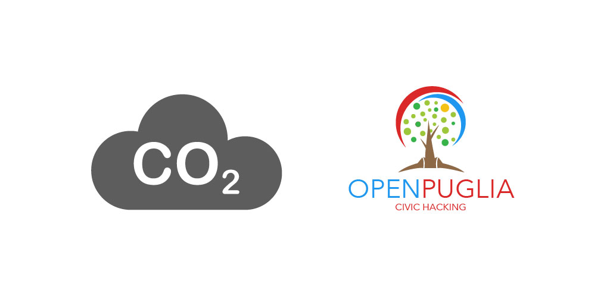
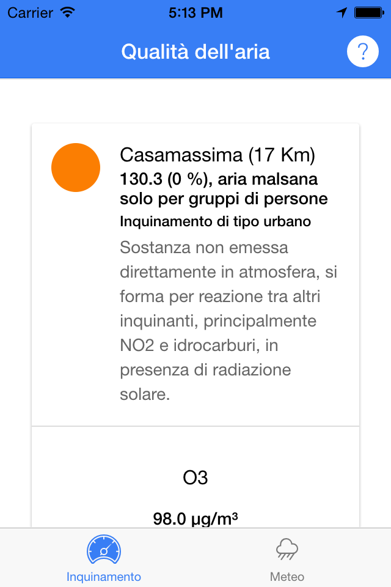
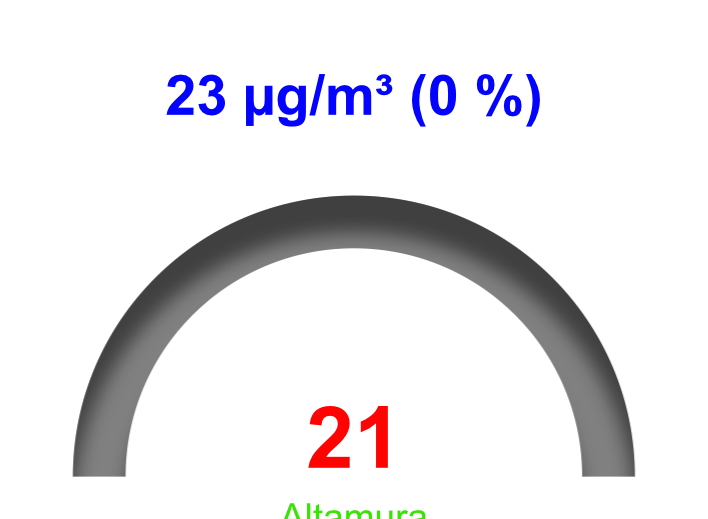
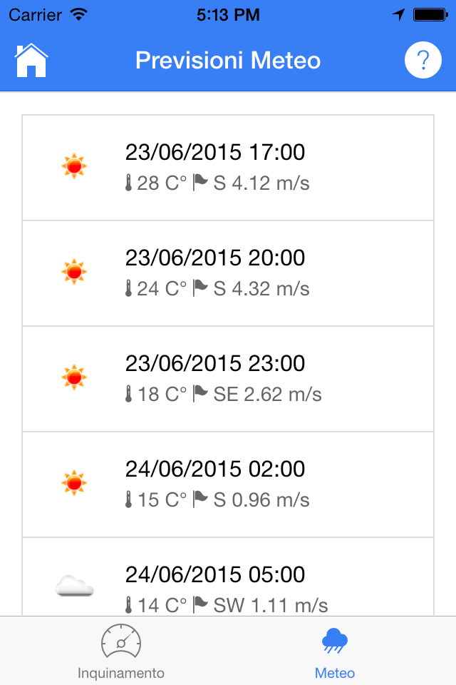

# CO2

CO2 è una App sviluppata per il monitoraggio dei dati ambientali in Puglia, rilevati dalle centraline [ARPA](http://www.arpa.puglia.it/web/guest/qariainq) distribuite su tutto il [territorio regionale](https://www.arpa.puglia.it/c/document_library/get_file?uuid=68743289-14f7-4f12-aaa3-e3e4087f6675&groupId=13883).

La Rete Regionale ARPA è costituita da 55 stazioni, che rilevano i seguenti inquinanti:

* [PM10](https://it.wikipedia.org/wiki/PM10): Insieme di sostanze solide e liquide con diametro inferiore a 10 micron. Derivano da emissioni di autoveicoli, processi industriali, fenomeni naturali. 
* [PM2.5](https://it.wikipedia.org/wiki/Particolato): Insieme di sostanze solide e liquide con diametro inferiore a 2.5 micron. Derivano da processi industriali, processi di combustione, emissioni di autoveicoli, fenomeni naturali. 
* [O3 (Ozono)](https://it.wikipedia.org/wiki/Ozono): Sostanza non emessa direttamente in atmosfera, si forma per reazione tra altri inquinanti, principalmente NO2 e idrocarburi, in presenza di radiazione solare.
* [NO2 (Diossido di azoto)](https://it.wikipedia.org/wiki/Diossido_di_azoto): Gas tossico che si forma nelle combustioni ad alta temperatura. Sue principali sorgenti sono i motori a scoppio, gli impianti termici, le centrali termoelettriche.
* [CO (Monossido di carbonio)](https://it.wikipedia.org/wiki/Monossido_di_carbonio): Sostanza gassosa, si forma per combustione incompleta di materiale organico, ad esempio nei motori degli autoveicoli e nei processi industriali.
* [C6H6 (Benzene)](https://it.wikipedia.org/wiki/Benzene): Liquido volatile e dall’odore dolciastro. Deriva dalla combustione incompleta del carbone e del petrolio, dai gas esausti dei veicoli a motore, dal fumo di tabacco.
* [SO2 (Biossido di zolfo)](https://it.wikipedia.org/wiki/Diossido_di_zolfo): Gas irritante, si forma soprattutto in seguito all'utilizzo di combustibili (carbone, petrolio, gasolio) contenenti impurezze di zolfo.
* [H2S](https://it.wikipedia.org/wiki/Acido_solfidrico): Gas incolore dall'odore caratteristico di uova marce. L’H2S di origine antropica si forma, tra l’altro, nei processi di depurazione delle acque reflue, produzione di carbon coke, raffinazione del petrolio.
* [Black Carbon](https://it.wikipedia.org/wiki/Nero_di_carbone): Inquinante costituito da polvere finissima di carbone costituita al 95-99% da carbonio e da molecole aromatiche. È emesso soprattutto durante la combustione incompleta del carbone.
* [IPA](https://it.wikipedia.org/wiki/Idrocarburi_policiclici_aromatici): Inquinanti organici costituiti da più anelli benzenici condensati, si formano per combustione incompleta di combustibili fossili ma anche di legno e rifiuti. (Uno di essi, il benzo(a)pirene, è classificato dalla IARC ha come cancerogeno per l’uomo).

## [Indice di qualità dell'aria](http://en.wikipedia.org/wiki/Air_quality_index)
I dati di monitoraggio dell'aria vengono rilevati dalle centraline ARPA più vicine alla posizione del dispositivo, e viene assegnato un indice di qualità dell'aria secondo questi colori: 

 Nessun rischio per la salute 
 Per alcuni individui ipersensibili si dovrebbe ridurre l'eserzio fisico all'aperto. 
 Potrebbero soppragiungere alcune irritazioni, individui con problemi di resporazione e cardiaci dovrebbero ridurre le attività all'esterno. 
 Potrebbero soppragiungere alcune irritazioni, individui con problemi di resporazione e cardiaci dovrebbero ridurre le attività all'esterno. 
 E' in pericolo la salute delle persone, gli individui con problemi respiratori e cardiaci devono evitare di uscire di casa. 
 E' in pericolo la salute delle persone, gli individui con problemi respiratori e cardiaci devono evitare di uscire di casa. 
 E' rischioso per qualsiasi individuo, possibili sintomi di irritazione, evitare di uscire di casa. 
 Estremamente pericoloso per la salute di qualsiasi individuo. 

## Rilevamento della qualità dell'aria

### Indicatore 

## Mappa degli inquinanti

## Previsioni Meteo

## Riferimento

La App è stata sviluppata con [IonicFramework](http://www.ionicframework.com) 
Post sul blog dello sviluppatore, [CO2, Un naso elettronico sul vostro smartphone](http://giuseppezileni.github.io/app/2015/06/20/co2.html)

## Autore
* [OpenPuglia](http://www.openpuglia.org)
* [Giuseppe Zileni](http://giuseppezileni.github.io) | [twitter](http://www.twitter.com/gzileni) | [linkedin](https://it.linkedin.com/in/giuseppezileni)

## Support
